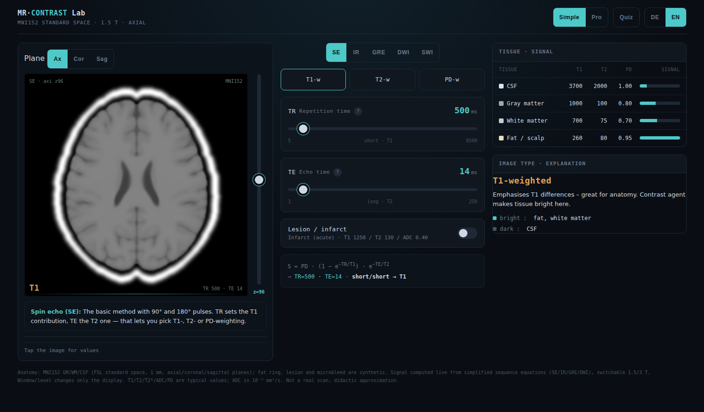

# MR Contrast Lab

**An interactive, offline browser tool for learning MRI.** See how acquisition parameters (TR, TE, TI, flip angle, b-value) and sequences (SE, IR, GRE, DWI, SWI) shape image contrast on real brain anatomy — every pixel is computed live from the signal equations as you drag the sliders. No install, no build step, no data leaves your machine. Bilingual (English / Deutsch).

**▶ Live demo:** https://mendeltem.github.io/mrt-contrat-trainer/mri-kontrast-simulator.html
**Repository:** https://github.com/mendeltem/mrt-contrat-trainer

> ⚠️ **Educational tool, not a medical device.** Images are computed from *simplified* signal equations on a standard brain template — not from a real scan. Tissue values are typical references and vary by scanner and vendor. Lesions and microbleeds are synthetic. Do not use for diagnosis.



---

## Features

- **Sequences:** Spin Echo, Inversion Recovery (FLAIR / STIR), Gradient Echo, DWI (+ ADC) and SWI — with one-click presets (T1, T2, PD, FLAIR, STIR, T1-GRE, T2\*, b0 / b1000 …).
- **Real anatomy** from the MNI152 template, in three planes (axial / coronal / sagittal) with multiple slices each.
- **Live weighting read-out** and a context card (*Image type · explanation*) that follows the current sequence — including which tissues appear bright vs dark.
- **Field strength** toggle 1.5 T ↔ 3 T (tissue T1/T2 update accordingly).
- **Pathology:** lesion types (vasogenic oedema, acute infarct, tumour, MS) and microbleed blooming — placed in true 3-D, so they only appear on the slices they actually pass through.
- **Analysis:** pixel probe (tissue + signal), live signal-vs-TE/b curves, contrast meter (ΔS + optimal TE), and a noise / SNR slider.
- **Tools:** side-by-side compare of two sequences, anatomy labels, window/level, PNG export, and a shareable state link.
- **Simple / Pro** interface — a clean default, with everything advanced tucked into collapsible groups.
- **Quiz mode**, glossary with sources, fully responsive layout, EN / DE.

---

## Run it

Static HTML — no server or dependencies required.

- **Quickest:** download `mri-kontrast-simulator.html` and double-click it to open in your browser.
- **Local server (optional):**
  ```bash
  python3 -m http.server
  # then open http://localhost:8000/mri-kontrast-simulator.html
  ```
- **GitHub Pages:** enable Pages on the `main` branch — the tool is then live at
  `https://mendeltem.github.io/mrt-contrat-trainer/mri-kontrast-simulator.html`
  (tip: rename the file to `index.html` for a shorter URL).

---

## How it works

- The brain comes from the **MNI152 (ICBM152) standard template**; grey matter, white matter and CSF maps are turned into per-pixel tissue fractions and pre-rendered for axial, coronal and sagittal slices.
- For each pixel the displayed signal is the tissue-weighted result of standard equations, e.g.
  - Spin echo: `S = PD · (1 − e^(−TR/T1)) · e^(−TE/T2)`
  - Inversion recovery: `S = PD · |1 − 2·e^(−TI/T1) + e^(−TR/T1)| · e^(−TE/T2)`
  - Spoiled GRE, DWI (`S = S0 · e^(−b·ADC)`) and an ADC map are handled similarly.
- Window / level, noise and zoom affect only the *display*, not the computed signal.

It is a deliberate simplification (single-compartment relaxation, on-resonance, synthetic fat/lesions, illustrative blooming) chosen so the *relationships* are correct and visible — not the absolute numbers.

---

## Tech

Vanilla JavaScript, HTML and CSS — no frameworks, no build, no external runtime calls. The image is drawn on a `<canvas>`; slice data is embedded as base64 so the tool is a single portable file. Web fonts load from Google Fonts when online and fall back to system fonts offline.

---

## Accuracy & sources

Equations and reference values were cross-checked against widely used MRI-physics resources such as *Questions and Answers in MRI* (mriquestions.com) and *Radiopaedia*. Numbers are typical 1.5 T / 3 T references and will differ from any specific scanner.

---

## License

Code is released under the **MIT License** — see [`LICENSE`](LICENSE).

The brain template (**MNI152 / ICBM152**, Montreal Neurological Institute) is covered by its own terms, not by MIT. If you redistribute the embedded slice data, keep the appropriate attribution.

---

## Disclaimer

This project is for **education and self-study only**. It does not produce real MR images and must not be used for clinical decisions, diagnosis, or as a substitute for training on real scanners.
